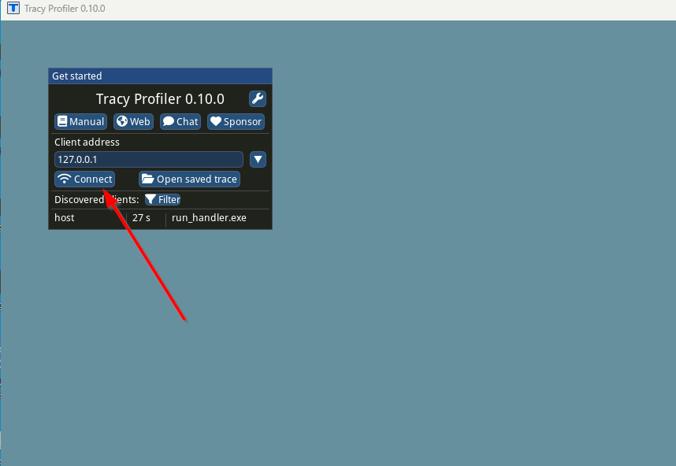

# run_handler example

The run_handler example demonstrates how to process a json formatted event using a JavaScript handler function.

The sample events and handler functions are located in the `src/hyperlight-js/examples/data` directory.

Each subdirectory in the `src/hyperlight-js/examples/data` directory contains an example that `run_handler` can run. The name of the subdirectory is the name of the example.

Within each subdirectory, there are two files:

- `data.json` - contains the event data that the handler function will process. This should be a valid JSON object.
- `handler.js` - contains the JavaScript handler function that will process the event data. The handler function should be a valid JavaScript function that takes a single argument, the event data, and returns a JSON object.

## Running the example

The `run_handler` example can be passed an argument to specify which example to run. In this case, the argument should be the name of the subdirectory in `src/hyperlight-js/examples/data` that contains the example to run. The example will be run and then the program will quit. For example running:

```console
cargo run --example run_handler echo --release
```

Will compile the program in release mode and run the `echo` example. Produce the following output:

```console
Time to get loaded sandbox with  3 handlers: 567.177µs
Running example: echo
handler input:
"hello, world!"
handler output:
"hello, world!"
Time to execute: 186.655µs
```

And then quit.

If no argument is provided, `run_handler` will prompt the user to enter the name of the example to run. The valid names are the names of the subdirectories in `src/hyperlight-js/examples/data`. If the user enters `exit`, the program will quit.

## Profiling

The `run_handler` example can be profiled using [tracy](https://github.com/wolfpld/tracy). See [here](https://www.youtube.com/watch?v=fB5B46lbapc) for an overview of tracy.

In order to enable profiling, the `ENABLE_TRACY` environment variable must be set to `1`. For example:

Windows:

```console
$env:ENABLE_TRACY=1
cargo run --example run_handler --release
```

Linux:

```console  
ENABLE_TRACY=1 cargo run --example run_handler --release
```

You can then start the tracy profiler and connect to the running program. The profiler will display the execution time of each function in the program:



## Obtaining the tracy profiler

The tracy profiler can be obtained from the [tracy](https://github.com/wolfpld/tracy) repository. Releases contain a 7z archive that contains pre-built binaries for Windows, for other platforms you will need to build the profiler yourself. Because of this it can be useful to run the profiler on Windows when running the profilee on Linux. The profiler can easily be connected by port forwarding from the remote Linux machine to the local Windows machine.

```console
ssh -L 8086:localhost:8086 user@remote
```

Then connect as shown above from the tracy profiler running on Windows.
