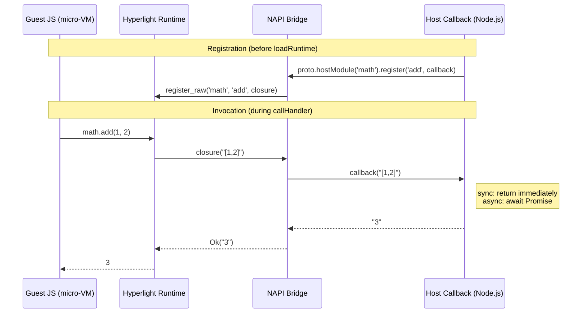

# Hyperlight JS Host API

Node.js bindings for hyperlight-js

## Installation

```bash
npm install @hyperlight/js-host-api
```

## Quick Start

```javascript
import { SandboxBuilder } from '@hyperlight/js-host-api';

// Create and build a sandbox
const builder = new SandboxBuilder();
const protoSandbox = await builder.build();

// Load the JavaScript runtime
const jsSandbox = await protoSandbox.loadRuntime();

// Add a handler function (sync — no await needed)
// First arg is a routing key; the function must be named 'handler'
jsSandbox.addHandler('greet', `
  function handler(event) {
    event.message = 'Hello, ' + event.name + '!';
    return event;
  }
`);

// Get the loaded sandbox
const loadedSandbox = await jsSandbox.getLoadedSandbox();

// Call the handler using the routing key
const result = await loadedSandbox.callHandler('greet', { name: 'World' });
console.log(result); // { name: 'World', message: 'Hello, World!' }
```

> **Note:** All sandbox operations that touch the hypervisor (`build`, `loadRuntime`,
> `getLoadedSandbox`, `callHandler`, `unload`, `snapshot`,
> `restore`) return Promises and run on background threads (`spawn_blocking`),
> so they don't block the Node.js event loop. However, if a guest call triggers
> a host function callback, that callback executes on the main V8 thread
> (see [Host Functions](#host-functions) for details).

## API

### SandboxBuilder

Creates and configures a new sandbox.

**Methods:**
- `setHeapSize(bytes: number)` → `this` — Set guest heap size (must be > 0, chainable)
- `setScratchSize(bytes: number)` → `this` — Set guest scratch size, includes stack (must be > 0, chainable)
- `setInputBufferSize(bytes: number)` → `this` — Set guest input buffer size (must be > 0, chainable)
- `setOutputBufferSize(bytes: number)` → `this` — Set guest output buffer size (must be > 0, chainable)
- `build()` → `Promise<ProtoJSSandbox>` — Builds a proto sandbox ready to load the JavaScript runtime

```javascript
const builder = new SandboxBuilder()
    .setHeapSize(8 * 1024 * 1024)
    .setScratchSize(1024 * 1024);
const protoSandbox = await builder.build();
```

### ProtoJSSandbox

A proto sandbox ready to load the JavaScript runtime. This is also where
you register **host functions** — callbacks that guest sandboxed code can
call. See [Host Functions](#host-functions) below.

**Methods:**
- `loadRuntime()` → `Promise<JSSandbox>` — Loads the JavaScript runtime into the sandbox. All host functions registered via `hostModule()` / `register()` are applied before the runtime loads.
- `hostModule(name: string)` → `HostModule` — Create a builder for registering functions in a named module
- `register(moduleName, functionName, callback)` — Convenience method to register a single host function (args are spread, return value auto-stringified)

```javascript
// Register host functions, then load the runtime
const math = protoSandbox.hostModule('math');
math.register('add', (a, b) => a + b);

const jsSandbox = await protoSandbox.loadRuntime();
```

### JSSandbox

A sandbox with the JavaScript runtime loaded, ready for handlers.

**Methods:**
- `addHandler(name: string, code: string)` — Adds a JavaScript handler function (sync)
- `getLoadedSandbox()` → `Promise<LoadedJSSandbox>` — Gets the loaded sandbox ready to call handlers
- `clearHandlers()` — Clears all registered handlers (sync)
- `removeHandler(name: string)` — Removes a specific handler by name (sync)

```javascript
// Add a handler (sync) — routing key can be any name, but the function must be named 'handler'
sandbox.addHandler('myHandler', 'function handler(input) { return input; }');

// Get loaded sandbox (async)
const loaded = await sandbox.getLoadedSandbox();

// Clear all handlers (sync)
sandbox.clearHandlers();

// Remove specific handler by routing key (sync)
sandbox.removeHandler('myHandler');
```

### LoadedJSSandbox

A sandbox with handlers loaded, ready to process events.

**Methods:**
- `callHandler(handlerName: string, eventData: any, options?: CallHandlerOptions)` → `Promise<any>` — Calls a handler with event data (any JSON-serializable value). Pass options with `gc: false` to skip post-call garbage collection, or with `wallClockTimeoutMs`/`cpuTimeoutMs` to enforce resource limits ⏱️
- `unload()` → `Promise<JSSandbox>` — Unloads all handlers and returns to JSSandbox state
- `snapshot()` → `Promise<Snapshot>` — Takes a snapshot of the sandbox state
- `restore(snapshot: Snapshot)` → `Promise<void>` — Restores sandbox state from a snapshot

**Properties:**
- `interruptHandle` → `InterruptHandle` — Gets a handle to interrupt/kill handler execution (getter, not a method)
- `poisoned` → `boolean` — Whether the sandbox is in a poisoned (inconsistent) state

```javascript
// Call a handler with event data — pass objects directly, get objects back
const result = await loaded.callHandler('handler', { data: "value" });

// Call with wall-clock timeout only
try {
    const result = await loaded.callHandler('handler', {}, {
        wallClockTimeoutMs: 1000,
    });
} catch (error) {
    if (error.code === 'ERR_CANCELLED') {
        console.log('Handler exceeded 1s wall-clock timeout');
    } else {
        throw error; // unexpected — don't swallow it
    }
}

// Call with CPU time timeout only (better for pure computation)
try {
    const result = await loaded.callHandler('handler', {}, {
        cpuTimeoutMs: 500,
    });
} catch (error) {
    if (error.code === 'ERR_CANCELLED') {
        console.log('Handler exceeded 500ms CPU time');
    } else {
        throw error;
    }
}

// Recommended: Both monitors (OR semantics — first to fire terminates)
try {
    const result = await loaded.callHandler('handler', {}, {
        wallClockTimeoutMs: 5000,
        cpuTimeoutMs: 500,
    });
} catch (error) {
    if (error.code === 'ERR_CANCELLED') {
        console.log('Handler exceeded a resource limit');
    } else {
        throw error;
    }
}

// Unload all handlers to reset state
const sandbox = await loaded.unload();

// Get interrupt handle (property getter, not a method call)
const handle = loaded.interruptHandle;

// Snapshot and restore
const snapshot = await loaded.snapshot();
// ... do something that poisons the sandbox ...
await loaded.restore(snapshot);
```

### CallHandlerOptions

Configuration for execution monitors (optional). When no timeouts are specified,
the handler runs without any monitors.

| Property | Type | Description |
|----------|------|-------------|
| `wallClockTimeoutMs` | `number?` | Wall-clock timeout in ms.  |
| `cpuTimeoutMs` | `number?` | CPU time timeout in ms. Catches compute-bound abuse (tight loops, etc) |
| `gc` | `boolean?` | Whether to run GC after the handler call. Defaults to `true` |

When both timeouts are set, monitors race with **OR semantics** — whichever fires first terminates execution. This is the **recommended** pattern for comprehensive protection.

### InterruptHandle ⏱️

Handle for interrupting/killing handler execution. Because hypervisor calls run on background threads and return Promises, you can call `kill()` from a timer, a signal handler, or any async callback while a handler is running.

**Methods:**
- `kill()` — Immediately stops the currently executing handler in the sandbox

```javascript
// Get interrupt handle 
const handle = loaded.interruptHandle;

// Kill from a timer 
const timer = setTimeout(() => handle.kill(), 2000);
const result = await loaded.callHandler('handler', {});
clearTimeout(timer);
```

**Recommended:** Pass timeout options to `callHandler()` instead for built-in timeout support:

```javascript
// Combined monitors — the recommended pattern 🛡️
try {
    const result = await loaded.callHandler('handler', {}, {
        wallClockTimeoutMs: 5000,
        cpuTimeoutMs: 500,
    });
} catch (error) {
    console.log('Handler killed by monitor');
}
```

**CPU Time vs Wall Clock:**
- **Wall Clock** (`wallClockTimeoutMs`): Measures real-world elapsed time. Catches resource exhaustion where the guest holds host resources without burning CPU. (Not really possible today unless the guest calls a host function that blocks)
- **CPU Time** (`cpuTimeoutMs`): Measures only actual CPU execution time. Catches compute-bound abuse. Supported on Linux and Windows.
- **Combined** (both set): Best protection — neither alone is sufficient.

### Snapshot

An opaque handle representing a point-in-time snapshot of the sandbox state. Use `snapshot()` to capture and `restore()` to roll back after a poisoned state or any other reason.

```javascript
const snapshot = await loaded.snapshot();

// ... handler gets killed, sandbox is poisoned ...

await loaded.restore(snapshot);
console.log(loaded.poisoned); // false — back to normal
```

### Error Codes

All errors thrown by the API include a `code` property for programmatic handling:

| Code | Meaning |
|------|---------|
| `ERR_INVALID_ARG` | Bad argument (empty handler name, zero timeout, etc.) |
| `ERR_CONSUMED` | Object already consumed (e.g., calling `loadRuntime()` twice) |
| `ERR_POISONED` | Sandbox is in an inconsistent state (after timeout kill, guest abort, stack overflow, etc.) — restore from snapshot or unload |
| `ERR_CANCELLED` | Execution was cancelled (by monitor timeout or manual `kill()`) |
| `ERR_GUEST_ABORT` | Guest code aborted |
| `ERR_INTERNAL` | Unexpected internal error |

```javascript
try {
    await loaded.callHandler('handler', {});
} catch (error) {
    switch (error.code) {
        case 'ERR_CANCELLED':
            console.log('Execution was cancelled');
            break;
        case 'ERR_POISONED':
            console.log('Sandbox is poisoned (e.g. stack overflow, timeout)');
            break;
        default:
            console.log(`Unexpected error [${error.code}]: ${error.message}`);
    }
}
```

## Host Functions

Host functions let sandboxed guest JavaScript call back into the host
(Node.js) environment. This is how you extend the sandbox capabilities.

### How It Works



1. **Register** host functions on the `ProtoJSSandbox` (before loading the runtime)
2. **Guest code** imports them as ES modules: `import * as math from "host:math"`
3. **At call time**, the guest's arguments are JSON-serialised and dispatched to the Node.js main thread via a threadsafe function (V8 is single-threaded, so callbacks *must* execute there). The JSON result is then returned to the guest

### Quick Start

```javascript
const { SandboxBuilder } = require('@hyperlight/js-host-api');

const proto = await new SandboxBuilder().build();

// Register a sync host function — args are spread, return auto-stringified
proto.hostModule('math').register('add', (a, b) => a + b);

// Load the runtime (applies all registrations)
const sandbox = await proto.loadRuntime();

// Guest code can now call math.add()
sandbox.addHandler('handler', `
    import * as math from "host:math";
    function handler(event) {
        return { result: math.add(event.a, event.b) };
    }
`);

const loaded = await sandbox.getLoadedSandbox();
const result = await loaded.callHandler('handler', { a: 10, b: 32 });
console.log(result); // { result: 42 }
```

### The JSON Wire Protocol

All arguments and return values cross the sandbox boundary as **JSON strings**.
With `register()`, this is handled automatically — your callback receives
individual arguments (parsed from the JSON array) and the return value is
automatically `JSON.stringify`'d.

```javascript
// Guest calls: math.add(1, 2)
// Your callback receives: (1, 2) — individual args, already parsed
// Your return value: 3 — automatically stringified to '3'
math.register('add', (a, b) => a + b);

// Guest calls: db.query("users")
// Your callback receives: ("users") — the single string arg
// Your return value is automatically stringified
db.register('query', (table) => ({
    rows: [{ id: 1, name: 'Alice' }],
}));
```

> **Why JSON strings?** The guest runs in a separate micro-VM with its own
> JavaScript engine. There's no shared object graph — serialisation is the
> only way to cross the boundary. JSON is universal, debuggable, and fast
> enough for the vast majority of use cases.

### API Reference

#### `proto.hostModule(name)` → `HostModule`

Creates a builder for a named module. The module name is what guest code
uses in its `import` statement.

```javascript
const math = proto.hostModule('math');
// Guest: import * as math from "host:math";
```

Throws `ERR_INVALID_ARG` if name is empty.

#### `builder.register(name, callback)` → `HostModule`

Registers a function within the module. Returns the builder for chaining.
Arguments are auto-parsed from the guest's JSON array and spread into your
callback. The return value is automatically `JSON.stringify`'d.

```javascript
const math = proto.hostModule('math');
math.register('add', (a, b) => a + b);
math.register('multiply', (a, b) => a * b);
```

Throws `ERR_INVALID_ARG` if function name is empty.

#### `proto.register(moduleName, functionName, callback)`

Convenience shorthand — equivalent to `proto.hostModule(moduleName).register(functionName, callback)`.

```javascript
proto.register('strings', 'upper', (s) => s.toUpperCase());
```

### Async Callbacks

Host function callbacks can be `async` or return a `Promise`. The bridge
automatically awaits the result before returning to the guest:

```javascript
proto.hostModule('api').register('fetchUser', async (userId) => {
    const response = await fetch(`https://api.example.com/users/${userId}`);
    return await response.json();
});
```

From the guest's perspective, the call is still synchronous — `api.fetchUser(42)`
blocks until the host's async work completes. The callback runs on the Node.js
main thread (V8 is single-threaded), so **synchronous callbacks briefly occupy
the event loop**. For `async` callbacks, the event loop is free during awaited
I/O (database queries, HTTP requests, etc.) — just like any other async
Node.js code.

> **Important — why the guest blocks today:**
>
> Hyperlight's host function type is synchronous:
> ```rust
> type BoxFunction = Box<dyn Fn(String) -> Result<String> + Send + Sync>
> ```
> When guest code calls `math.add(1, 2)`, the QuickJS VM inside the micro-VM
> freezes — it's a blocking `Fn` call, not a `Future`. There's no suspend/resume
> mechanism in hyperlight-host or hyperlight-common today.
>
> The NAPI bridge uses a `ThreadsafeFunction` to dispatch callbacks to the
> Node.js main thread and waits for the result via a oneshot channel. This
> allows both sync and async JS callbacks to work transparently.

### Error Handling

If your callback throws (sync) or rejects (async), the error propagates
to the guest as a `HostFunctionError`:

```javascript
proto.hostModule('auth').register('validate', (token) => {
    if (!token) {
        throw new Error('Token is required');
    }
    return { valid: true };
});
```

```javascript
// Guest code
import * as auth from "host:auth";
function handler(event) {
    try {
        return auth.validate(event.token);
    } catch (e) {
        return { error: e.message };
    }
}
```

### Registration Timing

Host functions must be registered **before** calling `loadRuntime()`.
Registrations are accumulated and applied in bulk when the runtime loads.

```javascript
const proto = await new SandboxBuilder().build();

// ✅ Register before loadRuntime()
proto.hostModule('math').register('add', (a, b) => a + b);
proto.hostModule('strings').register('upper', (s) => s.toUpperCase());

const sandbox = await proto.loadRuntime(); // all registrations applied here
```

### Snapshot / Restore

Host functions survive snapshot/restore cycles. The snapshot captures the
guest micro-VM's memory — the host-side JS callbacks live in the Node.js
process and are unaffected by restore:

```javascript
// Host-side counter — lives in Node.js, outside the micro-VM
let callCount = 0;

const proto = await new SandboxBuilder().build();
proto.register('stats', 'hit', () => {
    callCount++;
    return callCount;
});

const sandbox = await proto.loadRuntime();
sandbox.addHandler('handler', `
    import * as stats from "host:stats";
    function handler() {
        return { count: stats.hit() };
    }
`);

const loaded = await sandbox.getLoadedSandbox();
const snapshot = await loaded.snapshot();

await loaded.callHandler('handler', {}); // callCount → 1
await loaded.callHandler('handler', {}); // callCount → 2

await loaded.restore(snapshot); // guest VM memory reset, callCount still 2

await loaded.callHandler('handler', {}); // callCount → 3
```

### Architecture Notes

How the NAPI bridge works under the hood.

**The problem:** Hyperlight's host function dispatch runs on a `spawn_blocking`
thread (so it doesn't block the Node.js event loop). But the JS callback must
run on the main V8 thread. And the callback might be `async`.

**The solution — ThreadsafeFunction with return value:**

```
spawn_blocking thread          Node.js main thread
────────────────────           ────────────────────
1. Parse args from JSON
2. Create oneshot channel
3. Fire TSFN with             
   (args, callback) ──────► 4. TSFN calls JS callback with
                                  spread args
                               5. Callback returns (sync or
                                  Promise)
                               6. Result sent via callback
◄──────────────────────────── 
7. block_on(receiver)
   gets the Promise
8. await Promise
9. JSON stringify result
10. Return to guest
```

This design:
- Works for **both** sync and async JS callbacks
- For `async` callbacks, the event loop is free during awaited I/O (sync callbacks briefly occupy it — V8 is single-threaded)
- Uses napi-rs `call_with_return_value` for simple async result handling
- JSON serialization is handled automatically by the bridge

## Examples

See the `examples/` directory for complete examples:

### Simple Usage (`simple.js`)
Basic "Hello World" demonstrating the sandbox lifecycle.

### Calculator (`calculator.js`)
JSON event processing with multiple operations.

### Unload/Reload (`unload.js`)
Handler lifecycle management — unload handlers, reset state, and load new handlers.

### Interrupt/Timeout (`interrupt.js`) ⏱️
Timeout-based handler termination using wall-clock timeout. Demonstrates killing a 4-second handler after 1 second using `callHandler()`.

### CPU Timeout (`cpu-timeout.js`) 🚀
Combined CPU + wall-clock monitoring — the recommended pattern for comprehensive resource protection. Demonstrates OR semantics where the CPU monitor fires first for compute-bound work, with wall-clock as backstop.

### Host Functions (`host-functions.js`)
Registering sync and async host functions that guest code can call. Demonstrates
`hostModule().register()` with spread args, `async` callbacks, and the convenience
`register()` API.

## Requirements

- **Node.js** >= 18

## Building from Source

### Build Commands

```bash
# Install dependencies
npm install

# Release builds (optimized)
npm run build

# Debug builds (with symbols)
npm run build:debug

# Run tests
npm test
```

### Using Just (Build Automation)

From the repository root:

```bash
# Build js-host-api
just build-js-host-api release

# Build with debug symbols
just build-js-host-api debug

# Run js-host-api examples
just run-js-host-api-examples release

# Run js-host-api tests
just test-js-host-api release

# Build and test everything (all runtimes and targets)
just build-all
just test-all release
```

## Publishing to npm

The package is published to npmjs.com as `@hyperlight/js-host-api` with platform-specific binary packages.

### Automated Release

Publishing happens automatically when a release is created via the `CreateRelease` workflow on a `release/vX.Y.Z` branch.

### Manual Publishing

You can also trigger the npm publish workflow manually:

1. Go to **Actions** → **Publish npm packages**
2. Click **Run workflow**
3. Enter the version (e.g., `0.17.0`)
4. Optionally enable **dry-run** to test without publishing

### Setup Requirements

The following secret must be configured in the repository:

| Secret | Description |
|--------|-------------|
| `NPM_TOKEN` | npm access token with publish permissions for the `@hyperlight` scope |

To create an npm token:
1. Log in to [npmjs.com](https://www.npmjs.com/)
2. Go to **Access Tokens** → **Generate New Token**
3. Select **Automation** token type (for CI/CD)
4. Add the token as a repository secret named `NPM_TOKEN`

### Package Structure

The npm release consists of three packages:

| Package | Description |
|---------|-------------|
| `@hyperlight/js-host-api` | Main package (installs correct binary automatically) |
| `@hyperlight/js-host-api-linux-x64-gnu` | Linux x86_64 native binary |
| `@hyperlight/js-host-api-win32-x64-msvc` | Windows x86_64 native binary |
